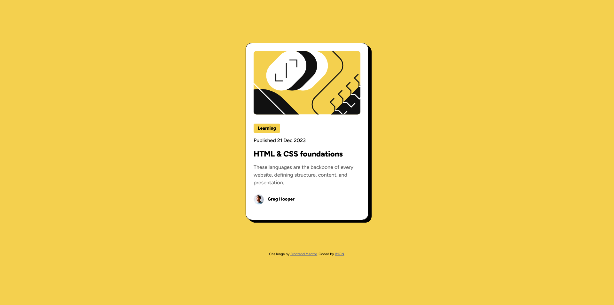

# Frontend Mentor – Blog Preview Card Solution

A simple, responsive blog‑preview card built to the [Frontend Mentor challenge](https://www.frontendmentor.io/challenges/blog-preview-card-ckPaj01IcS).

---

## Overview

- **Challenge:** Create a card component showing an article preview with image, category, date, title, description, and author profile.  
- **Screenshot:**  
    
- **Live Site:** https://imaginebillie.github.io/Blog-preview-card/  
- **Solution Repo:** https://github.com/ImagineBillie/Blog-preview-card.git

---

## My Process

**Built With**  
- Semantic HTML5  
- CSS Custom Properties  
- Flexbox  
- Responsive (mobile‑first) design  
- Variable fonts via `@font-face`

**What I Learned**  
- How to load and use variable fonts with `@font-face`.  
- When to Use Viewport height (vh), Viewport width (vw), rem, em, and More  
- Crafting a lightweight “3D” effect with layered `box-shadow`.

**Useful Resources**  
- [Google Fonts Variable Font Guide](https://fonts.google.com/knowledge)
- [MDN box-shadow Reference](https://developer.mozilla.org/docs/Web/CSS/box-shadow)
- [CSS Units](https://www.freecodecamp.org/news/css-units-when-to-use-each-one/)

---

## Acknowledgments

Thanks to Frontend Mentor for the challenge and all the community!
